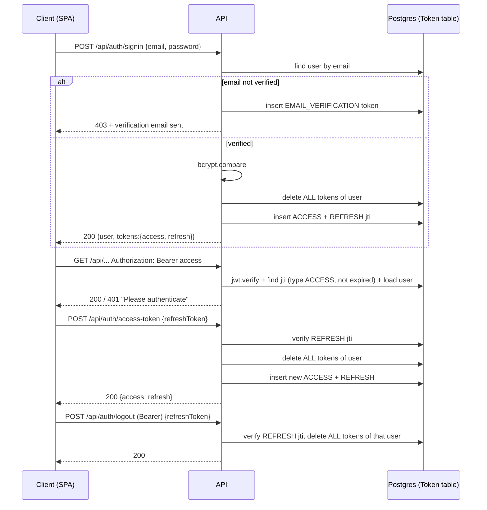

# Security and Access

Reviewed against the code on 2026-10-01. This is the authoritative description of server-side controls; the frontend's client-side handling is covered in the frontend repo's `docs/SECURITY_AND_ACCESS.md`. Line numbers are as of this review.

## 1. Actors and access levels

| Actor | Credential | Can reach |
|---|---|---|
| Anonymous visitor | none | `GET /health`, `/reference` (API docs), the unauthenticated `/api/auth/*` routes (signup, signin, verify-email, resend, forgot/reset password, access-token) |
| Guest | per-event `GuestEventInvite.invite_token` (UUID in the RSVP link) | `GET /api/rsvp/:token` and `PUT /api/rsvp/:token` for that one invite only |
| Authenticated host | Bearer access JWT | Everything else under `/api`, scoped to weddings where `wedding.user_id = req.user.id` |

There is **no admin, staff or role concept**. `User` has no role column ([schema.prisma](../prisma/schema.prisma) `model User`), and `req.user` is the only identity ([express.d.ts](../src/types/express.d.ts)). Admin/staff email template constants in [email.constant.ts](../src/utils/constants/email.constant.ts) are unused leftovers. Every host has the same capabilities over their own data and none over anyone else's.

## 2. Authentication

### 2.1 Token types

All four token types are HS256 JWTs signed with the single `JWT_SECRET` ([token.service.ts:66-79](../src/services/token.service.ts#L66-L79)) with payload `{ sub, jti, exp }`. The type is **not** in the JWT; each token's `jti` is stored in the `Token` table with a `token_type`, and [`verifyTokenService`](../src/services/token.service.ts#L124-L150) requires the signature, a matching DB row of the expected type, and a non-expired `expires_at`. A JWT without a DB row is rejected, so deleting rows revokes tokens immediately.

| Type | Lifetime (source) | Issued by | Consumed by | Revoked when |
|---|---|---|---|---|
| `ACCESS` | `JWT_ACCESS_EXPIRATION_MINUTES` (required; `.env.example`: 15) | signin, access-token | [`authenticate`](../src/middlewares/auth.middleware.ts) on every protected route | signin, refresh, logout (all of the user's tokens are deleted) |
| `REFRESH` | `JWT_REFRESH_EXPIRATION_DAYS` (required; example: 30) | signin, access-token | `POST /auth/access-token`, `POST /auth/logout` | same as above |
| `EMAIL_VERIFICATION` | `JWT_VERIFY_EMAIL_EXPIRATION_MINUTES`, default 10 ([token.service.ts:107](../src/services/token.service.ts#L107)) | signup, signin of an unverified account, resend | `POST /auth/verify-email` | on use ([auth.service.ts:163](../src/services/auth.service.ts#L163)), or by any signin/refresh/logout |
| `RESET_PASSWORD` | `JWT_RESET_PASSWORD_EXPIRATION_MINUTES`, default 10 ([token.service.ts:156-157](../src/services/token.service.ts#L156-L157)) | forgot-password | `PATCH /auth/reset-password` | on use ([auth.service.ts:240](../src/services/auth.service.ts#L240)), or by any signin/refresh/logout |

Env validation ([env.ts:15-19](../src/config/env.ts#L15-L19)) requires `JWT_SECRET` to be non-empty only. `jwt.verify` is called without an `algorithms` pin ([token.service.ts:131-134](../src/services/token.service.ts#L131-L134)); jsonwebtoken 9 still rejects `none` and non-HMAC algorithms for a string secret.

### 2.2 Storage

- **Server:** only `jti`, `user_id`, `token_type`, `expires_at` are stored ([token.repository.ts](../src/repositories/token.repository.ts)); raw tokens are never persisted.
- **Client:** tokens are returned in the JSON body. The SPA keeps the access token in memory and the refresh token in `localStorage` (see the frontend doc). No cookies are issued: `cookie-parser` is mounted ([index.ts:42](../src/index.ts#L42)) but nothing reads or sets a cookie, and `POST /auth/access-token` requires `refreshToken` in the body ([auth.validation.ts:73-79](../src/validations/auth.validation.ts#L73-L79)).

### 2.3 Sign-in, refresh, logout

Code: [`signInService`](../src/services/auth.service.ts#L97-L138), [`refreshTokenService`](../src/services/auth.service.ts#L244-L261), [`logoutService`](../src/services/auth.service.ts#L263-L280), [`authenticate`](../src/middlewares/auth.middleware.ts#L8-L44).

Consequences of "delete all tokens of the user" on signin/refresh/logout:
- One active session per user. Signing in elsewhere, or any refresh, revokes every other device's tokens.
- Refresh tokens rotate; an old refresh token is dead after use. There is no reuse detection, but a thief who refreshes first simply ends the victim's session (and vice versa).
- Outstanding verify-email and reset-password tokens are also deleted by any signin/refresh.
- `logoutService` revokes the owner of the refresh token in the body; it does not check that it belongs to `req.user` ([auth.service.ts:263-280](../src/services/auth.service.ts#L263-L280)). Low impact: holding someone's refresh token already allows more than logging them out.

### 2.4 Email verification

Signup creates the user with `is_email_verified=false` and emails a link `${WEB_APP_URL}/verify-email?token=<jwt>` ([email.service.ts](../src/services/email.service.ts) `sendEmail`, [utils.ts:7-9](../src/utils/utils.ts#L7-L9)). Signin is refused (403) until verified, and each such signin attempt issues and emails a fresh token ([auth.service.ts:106-122](../src/services/auth.service.ts#L106-L122)). Templates use Handlebars `{{ }}`, which HTML-escapes user names.

### 2.5 Password reset

`POST /auth/forgot-password` emails `${WEB_APP_URL}/reset-password?token=<jwt>` ([auth.service.ts:190-216](../src/services/auth.service.ts#L190-L216)). `PATCH /auth/reset-password` verifies the token, stores the new bcrypt hash and deletes only that reset token ([auth.service.ts:218-242](../src/services/auth.service.ts#L218-L242)). **Existing access/refresh tokens stay valid** (finding B3).

### 2.6 Password rules and hashing

- Hashing: bcrypt, cost 10 ([auth.service.ts:59](../src/services/auth.service.ts#L59), [:234](../src/services/auth.service.ts#L234)). bcrypt only uses the first 72 bytes.
- Rules: **none on the server**. Signup, login and reset bodies are plain `z.string()` ([auth.validation.ts:2-8](../src/validations/auth.validation.ts#L2-L8), [:62-65](../src/validations/auth.validation.ts#L62-L65)); `email` is not validated as an email or normalized for case. The 8-20 char / upper / lower / digit / symbol rule exists only in the SPA.
- Login failure returns the same `404 "Invalid email or password"` for unknown email and wrong password ([auth.service.ts:104](../src/services/auth.service.ts#L104), [:126](../src/services/auth.service.ts#L126)). Other endpoints do distinguish accounts (finding B5).

## 3. Authorization

### 3.1 Model

`authenticate` only establishes identity. **Ownership is enforced per endpoint in controllers/services**, always by joining back to `wedding.user_id`:

| Helper | Query | File |
|---|---|---|
| `getUserWeddingService(userId, weddingId)` | `wedding.findUnique({ id, user_id })`, 404 otherwise | [wedding.service.ts:142-151](../src/services/wedding.service.ts#L142-L151), [wedding.repository.ts:145-152](../src/repositories/wedding.repository.ts#L145-L152) |
| `verifyWeddingEventOwnershipService(eventId, userId)` | `event.findFirst({ id, wedding: { user_id } })` | [event.service.ts:170-177](../src/services/event.service.ts#L170-L177), [event.repository.ts:77-](../src/repositories/event.repository.ts#L77) |
| `getWeddingGuestService(userId, guestId)` | load guest, then wedding ownership | [guest.service.ts:170-186](../src/services/guest.service.ts#L170-L186) |
| `findGuestEventInviteForUser(inviteId, userId)` | `{ id, event: { wedding: { user_id } } }` | [guest.repository.ts:337-347](../src/repositories/guest.repository.ts#L337-L347) |
| `assertOwnedImageKeys(...)` | client-supplied S3 keys must be unchanged, null, or under `users/<userId>/` | [imageKeyOwnership.util.ts:31-45](../src/utils/imageKeyOwnership.util.ts#L31-L45) |

Mass assignment is limited because every route passes through [`validate`](../src/middlewares/validate.middleware.ts), and zod objects strip unknown keys; no request schema exposes `user_id`, `wedding_id` (on edit), `ai_credits`, `invite_token` or `is_email_verified`.

### 3.2 Permission matrix

Columns: **Anon** = no credential; **Guest** = holds an invite token; **Owner** = authenticated host who owns the target; **Other host** = authenticated, not the owner. "Self" means the row is keyed by `req.user.id`, so there is no other-user target.

| Endpoint | Anon | Guest | Owner | Other host | Enforced by |
|---|---|---|---|---|---|
| `POST /auth/signup`, `/signin`, `/resend-verify-email`, `/forgot-password` | yes | yes | yes | yes | public ([auth.routes.ts](../src/routes/auth.routes.ts)) |
| `POST /auth/verify-email`, `PATCH /auth/reset-password` | with valid token | - | - | - | `verifyTokenService` type check |
| `POST /auth/access-token` | with valid refresh token | - | - | - | `verifyTokenService(REFRESH)` |
| `POST /auth/logout` | no | no | self | revokes whoever owns the body's refresh token | `authenticate` + `logoutService` |
| `GET/PATCH /auth/me` | no | no | self | n/a | `req.user.id` ([auth.controller.ts:120-147](../src/controllers/auth.controller.ts#L120-L147)) |
| `GET /wedding`, `POST /wedding` | no | no | self | n/a | `user.id` passed to service/`createWedding` |
| `GET/PATCH/DELETE /wedding/:id`, `GET /:id/dashboard`, `GET /:id/live` | no | no | yes | 404 | `getUserWeddingService` ([wedding.controller.ts:57-118](../src/controllers/wedding.controller.ts#L57-L118)) |
| `GET /event?weddingId`, `POST /event` | no | no | yes | 404 | `getUserWeddingService` ([event.controller.ts:28](../src/controllers/event.controller.ts#L28), [:47](../src/controllers/event.controller.ts#L47)) |
| `GET/PATCH/DELETE /event/:id` | no | no | yes | 400 | `verifyWeddingEventOwnershipService` ([event.service.ts:179-239](../src/services/event.service.ts#L179-L239)) |
| `GET /guest`, `GET /guest/export`, `GET /guest/template/download/:id` | no | no | yes | 404 | `getUserWeddingService` ([guest.controller.ts:44](../src/controllers/guest.controller.ts#L44), [:115](../src/controllers/guest.controller.ts#L115), [:137](../src/controllers/guest.controller.ts#L137)) |
| `POST /guest` | no | no | yes | 400 | every `eventId` via `verifyWeddingEventOwnershipService`, all from one wedding ([guest.service.ts:74-95](../src/services/guest.service.ts#L74-L95)) |
| `GET/DELETE /guest/:id` | no | no | yes | 403 | `getWeddingGuestService` ([guest.controller.ts:79](../src/controllers/guest.controller.ts#L79), [:101](../src/controllers/guest.controller.ts#L101)) |
| `PATCH /guest/:id` | no | no | yes | 403/400 | guest ownership + each added event owned and in the guest's wedding ([guest.service.ts:188-240](../src/services/guest.service.ts#L188-L240)) |
| `POST /guest/template/upload/:id` | no | no | yes | **job is queued**; every row then fails ownership | **no wedding check at enqueue** ([guest.controller.ts:157-174](../src/controllers/guest.controller.ts#L157-L174)); rows go through `addNewGuestService` ([guest.service.ts:813](../src/services/guest.service.ts#L813)) |
| `GET /guest/import-status/:jobId` | no | no | yes | 404 | `job.data.userId !== userId` ([guest.service.ts:955-964](../src/services/guest.service.ts#L955-L964)) |
| `GET /guest/invites/whatsapp`, `GET /guest/invites/reminders` | no | no | yes | empty list | `event: { wedding: { user_id } }` in the query ([guest.service.ts:1012-1020](../src/services/guest.service.ts#L1012-L1020), [:1073-1079](../src/services/guest.service.ts#L1073-L1079)) |
| `POST /guest/invites/:inviteId/mark-sent`, `/mark-reminded` | no | no | yes | 404 | `findGuestEventInviteForUser` ([guest.service.ts:1042-1116](../src/services/guest.service.ts#L1042-L1116)) |
| `GET /page-setting/pages/:weddingId` | no | no | yes | 404 | `getUserWeddingService` ([eventInviteFormat.controller.ts:32](../src/controllers/eventInviteFormat.controller.ts#L32)) |
| `GET /page-setting/:id`, `GET /page-setting/event/:eventId` | no | no | yes | 404 / 400 | format → event ownership ([eventInviteFormat.service.ts:49-68](../src/services/eventInviteFormat.service.ts#L49-L68), [:115-126](../src/services/eventInviteFormat.service.ts#L115-L126)) |
| `PATCH /page-setting/:id` | no | no | yes | 400 | ownership + `assertOwnedImageKeys` for `raw_image`/`generated_image` ([eventInviteFormat.service.ts:70-113](../src/services/eventInviteFormat.service.ts#L70-L113)) |
| `POST /page-setting/generate-image` | no | no | yes (5 credits) | 400 | ownership + `assertOwnedImageKeys(raw_image)` + `spendCredits` ([eventInviteFormat.service.ts:128-186](../src/services/eventInviteFormat.service.ts#L128-L186)) |
| `GET /invite-card/cards/:weddingId` | no | no | yes | 404 | `getUserWeddingService` ([inviteCard.controller.ts:31](../src/controllers/inviteCard.controller.ts#L31)) |
| `PATCH /invite-card/:id`, `GET /invite-card/:id/generation-status` | no | no | yes | 400 | card → event ownership, `assertOwnedImageKeys` on PATCH ([inviteCard.service.ts:73-100](../src/services/inviteCard.service.ts#L73-L100), [:299-313](../src/services/inviteCard.service.ts#L299-L313)) |
| `POST /invite-card/generate-invite` | no | no | yes (10 credits) | 400 | ownership + `assertOwnedImageKeys` + credits in the same tx; the worker re-checks ownership ([inviteCard.service.ts:103-135](../src/services/inviteCard.service.ts#L103-L135), [:207](../src/services/inviteCard.service.ts#L207)) |
| `POST /general/generate-upload-url` | no | no | own prefix only | n/a | key rewritten under `users/<id>/` ([general.service.ts:9-30](../src/services/general.service.ts#L9-L30)) |
| `POST /general/generate-view-url` | no | no | own prefix or referenced key | 404 (but see B1) | [general.service.ts:34-55](../src/services/general.service.ts#L34-L55), [general.repository.ts:5-34](../src/repositories/general.repository.ts#L5-L34) |
| `PUT /rsvp/invite/:inviteId` | no | no | yes, deadline ignored | 404 | `{ id, event: { wedding: { user_id } } }` ([rsvp.service.ts:114-126](../src/services/rsvp.service.ts#L114-L126)) |
| `GET /rsvp/:token` | with token | own invite | with token | with token | `invite_token` lookup ([rsvp.service.ts:85-107](../src/services/rsvp.service.ts#L85-L107)) |
| `PUT /rsvp/:token` | with token | own invite, before deadline | with token | with token | `invite_token` + deadline in [`buildRsvpUpdate`](../src/utils/rsvp.util.ts#L19-L21) |

Not-owned responses use 400/403/404 with the same message as "missing", so ids of other users' records are not confirmed.

### 3.3 Ownership audit result

Every authenticated endpoint that takes a wedding/event/guest/invite/card/format id checks ownership before reading or writing. Gaps found:

1. `PATCH /auth/me` saves `profilePicture` without `assertOwnedImageKeys`, and `isObjectKeyReferencedByUser` trusts `user.profile_picture`. That turns any known S3 key into a viewable one (B1).
2. `POST /guest/template/upload/:id` queues the job for any wedding id. No cross-tenant write results because each row goes through `addNewGuestService`, which checks event ownership (B8).

## 4. Public surfaces

### 4.1 RSVP by invite token

- Routes: [rsvp.routes.ts:27-35](../src/routes/rsvp.routes.ts#L27-L35). The token is validated as a UUID ([rsvp.validation.ts:4-6](../src/validations/rsvp.validation.ts#L4-L6)).
- Entropy: `invite_token` is `uuidv4()` ([guest.service.ts:152](../src/services/guest.service.ts#L152), [:258](../src/services/guest.service.ts#L258)), i.e. 122 random bits, unique in the DB ([schema.prisma](../prisma/schema.prisma) `GuestEventInvite.invite_token @unique`). Guessing is not practical. There is one token per guest per event and no endpoint to rotate it: a forwarded link keeps working until the guest or invite is deleted.
- The slug in `/rsvp/:slug/:token` is cosmetic; only the token is looked up.
- Data returned ([rsvp.repository.ts:16-64](../src/repositories/rsvp.repository.ts#L16-L64)): guest `name`, `accomodation_required`, `accomodation_address`; event title/description/date/time/venue/address/city/lat/long/side; couple names and wedding slug; the invite's current reply and deadline; which questions are enabled; presigned URLs for the invitation card and RSVP illustration ([rsvp.service.ts:67-83](../src/services/rsvp.service.ts#L67-L83)). **Not** returned: guest phone/email/note, other guests, `wedding_id`, `invite_token`, host details.
- Writes: only `status`, `plus_ones` (0-9), `dietary`, `song_request` (≤500), `message` (≤500) ([rsvp.validation.ts:14-22](../src/validations/rsvp.validation.ts#L14-L22)); fields the host disabled are ignored ([rsvp.util.ts:26-38](../src/utils/rsvp.util.ts#L26-L38)).
- Deadline: enforced on the server for guests (`409 "RSVPs for this event are closed"`, [rsvp.util.ts:19-21](../src/utils/rsvp.util.ts#L19-L21)); the host path passes `ignoreDeadline`. Reads stay available after the deadline.
- Rate limits: `PUT` has `rsvpLimiter` (30/15 min/IP); `GET` has only the global limiter.
- Presigned image URLs contain the S3 key in their path, so guests can see keys such as `users/<hostUserId>/generated-images/...`. This matters only in combination with B1.

### 4.2 Live SSE stream

`GET /api/wedding/:id/live` requires `authenticate` plus `getUserWeddingService` before any header is flushed ([wedding.controller.ts:112-141](../src/controllers/wedding.controller.ts#L112-L141)). Events carry invite id, guest name, event title, status, plus-ones and time ([rsvpEvents.ts](../src/lib/rsvpEvents.ts) `toLiveRsvp`) and fan out only to listeners registered for that wedding id. Authorization is checked once, at connect: an open stream keeps receiving events after logout or access-token expiry until the connection closes. There is no per-user cap on concurrent streams (B11).

### 4.3 Health and API reference

- `GET /health` returns `{status, timestamp}` and is mounted before the rate limiter ([index.ts:49-51](../src/index.ts#L49-L51)).
- `/reference` serves the Scalar UI for the full OpenAPI spec without auth in every environment ([index.ts:65-73](../src/index.ts#L65-L73)). It lists routes and schemas, not data.

## 5. Data protection

### 5.1 PII held

| Model | Fields | Access |
|---|---|---|
| `User` | email, first/last name, mobile number, bcrypt password hash, profile picture key | self via `GET /auth/me` (password excluded, [user.repository.ts:44-60](../src/repositories/user.repository.ts#L44-L60)); `authenticate` deletes `password` from `req.user`. `PATCH /auth/me` does return the hash (B16) |
| `Guest` | name, email, mobile number, side, group, accommodation address, note | owner only; RSVP page exposes only name and accommodation to that guest |
| `GuestEventInvite` | reply, plus-ones, dietary, song request, free-text message | owner; the guest for their own invite |
| `Wedding` / `Event` | couple names, venues, addresses, coordinates | owner; event/couple details to token holders |
| S3 | couple photos, reference images, generated cards | presigned URLs only (5.2) |

Guest exports (`GET /guest/export`) and import job results (kept in Redis with `removeOnComplete: false`, [guest.queue.ts:29-32](../src/queues/guest.queue.ts#L29-L32)) also contain guest PII. Imported spreadsheets are written to `os.tmpdir()` and deleted only after a successful parse ([guest.worker.ts:21-27](../src/workers/guest.worker.ts#L21-L27)); a failed job leaves the file (B9). Deleting a user or wedding cascades in the DB; S3 objects are not deleted.

### 5.2 S3

- The DB stores object keys; clients get time-limited presigned URLs ([aws.service.ts:28-50](../src/services/aws.service.ts#L28-L50)).
- Uploads: the requested key is forced under `users/<userId>/` ([general.service.ts:14-17](../src/services/general.service.ts#L14-L17)), so users cannot overwrite each other's objects. `mime_type` is any non-empty string, and a presigned PUT does not bound object size (B10).
- Views: allowed when the key starts with the caller's prefix, or when a record the caller owns references it (`User.profile_picture`, `GuestEventInviteFormat.raw_image/generated_image`, `EventInviteCard.reference_image/generated_image/couple_raw_image_key/generated_invite_image_url/invite_design_image_url`). Otherwise 404 ([general.repository.ts:11-31](../src/repositories/general.repository.ts#L11-L31)).
- Writes of key columns: invite card and page settings go through `assertOwnedImageKeys`. `profile_picture` does not (B1).
- Expiry: every presigned URL, both PUT and GET and including the guest-facing ones, uses `AWS_BUCKET_PUT_URL_EXPIRE` (300 s in `.env.example`) ([general.service.ts:22](../src/services/general.service.ts#L22), [:48](../src/services/general.service.ts#L48), [rsvp.service.ts:75](../src/services/rsvp.service.ts#L75)). `AWS_BUCKET_GET_URL_EXPIRE` in [.env.example:24](../.env.example#L24) is not read anywhere.
- Server-side reads by key (`getBufferFromS3`) happen only after `assertOwnedImageKeys` or from stored records ([eventInviteFormat.service.ts:146-155](../src/services/eventInviteFormat.service.ts#L146-L155)).

### 5.3 Secrets and configuration

- Secrets come from env vars, validated at startup ([env.ts](../src/config/env.ts)); `.env` is git- and docker-ignored ([.gitignore](../.gitignore), [.dockerignore](../.dockerignore)).
- The container runs as the non-root `node` user ([dockerfile](../dockerfile)); Redis runs in the same container, and `REDIS_PASSWORD` is optional.
- `NODE_ENV=local` disables every rate limiter ([rateLimiter.middleware.ts:9](../src/middlewares/rateLimiter.middleware.ts#L9), [:27](../src/middlewares/rateLimiter.middleware.ts#L27), [:45](../src/middlewares/rateLimiter.middleware.ts#L45)), and `.env.example` ships with `NODE_ENV=local` ([.env.example:3](../.env.example#L3)) (B6).

### 5.4 Logging

pino writes to the console and `logs/app.log` ([logger.ts](../src/config/logger.ts)). No redaction is configured.

- Request log: method, `originalUrl`, status, duration, IP, user agent ([logger.middleware.ts:13-20](../src/middlewares/logger.middleware.ts#L13-L20)). Headers and bodies are not logged, so Authorization headers, passwords and refresh tokens are not either. However, `originalUrl` includes **RSVP invite tokens** (`/api/rsvp/<token>`) and query strings such as guest `search` terms.
- Error log: the error object and URL ([error.middleware.ts:12](../src/middlewares/error.middleware.ts#L12)). Clients only receive the `ApiError` message, or a generic 500.
- Email service logs recipient addresses ([email.service.ts:132-138](../src/services/email.service.ts#L132-L138)).
- `console.log` of the profile-update body (name, mobile, picture key) in [auth.controller.ts:135](../src/controllers/auth.controller.ts#L135) and [auth.service.ts:303](../src/services/auth.service.ts#L303).

## 6. Abuse controls

### 6.1 Rate limits

All limiters are `express-rate-limit` backed by Redis, keyed by `req.ip`, with `trust proxy = 1` ([index.ts:32](../src/index.ts#L32)). Correct keys therefore depend on exactly one trusted proxy in front of the API.

| Limiter | Window / max | Applied to | Source |
|---|---|---|---|
| `globalLimiter` | 15 min / 100 per IP | all `/api/*` | [rateLimiter.middleware.ts:24-39](../src/middlewares/rateLimiter.middleware.ts#L24-L39), [index.ts:53](../src/index.ts#L53) |
| `rsvpLimiter` | 15 min / 30 per IP | `PUT /api/rsvp/:token` | [rateLimiter.middleware.ts:42-57](../src/middlewares/rateLimiter.middleware.ts#L42-L57) |
| `imageGenerationLimiter` | 15 min / 5 per IP | `POST /api/invite-card/generate-invite` | [rateLimiter.middleware.ts:6-21](../src/middlewares/rateLimiter.middleware.ts#L6-L21) |
| (none) | - | `/api/auth/*` beyond global; `POST /api/page-setting/generate-image` | [auth.routes.ts](../src/routes/auth.routes.ts), [eventInviteFormat.route.ts:51-56](../src/routes/eventInviteFormat.route.ts#L51-L56) |

The project's `CLAUDE.md` mentions an `authLimiter`; **it does not exist** (B2). AI spend is also bounded by per-user credits, which start at 100 ([schema.prisma](../prisma/schema.prisma) `ai_credits @default(100)`) and are decremented atomically ([credits.service.ts:14-30](../src/services/credits.service.ts#L14-L30)). Because signup requires a verified email, extra credits cost an attacker extra mailboxes.

### 6.2 Uploads

- Guest spreadsheet: multer memory storage, 5 MB limit, no `fileFilter` ([upload.middleware.ts](../src/middlewares/upload.middleware.ts)). The file is parsed in the worker with `read-excel-file`; the `_meta` weddingId must match the URL, and each row is re-validated with `addNewGuestBodySchema`.
- Images: go directly to S3 by presigned PUT (5.2). Server-side image handling (Gemini inputs) is normalised with sharp ([imageNormalize.util.ts](../src/utils/imageNormalize.util.ts)) and MIME-checked ([imageValidation.util.ts](../src/utils/imageValidation.util.ts)).

### 6.3 Input validation

Every route except `GET /auth/me` has a zod schema via `validate` ([validate.middleware.ts](../src/middlewares/validate.middleware.ts)). Ids are `z.uuid()`, and enums, dates and lengths are constrained for wedding/event/guest/RSVP/page-setting/invite-card payloads. The weak spots are:
- auth bodies are plain strings (2.6);
- `page`/`limit` query params are free strings parsed with `parseInt` and no maximum (e.g. [wedding.controller.ts:24-25](../src/controllers/wedding.controller.ts#L24-L25), [guest.controller.ts:40-41](../src/controllers/guest.controller.ts#L40-L41));
- `jobId` is any non-empty string, but it is checked against the caller.

There is no raw SQL other than `SELECT 1` ([prisma.ts:19](../src/lib/prisma.ts#L19)); search terms go through Prisma.

### 6.4 CORS and headers

- `helmet()` defaults on every response ([index.ts:28](../src/index.ts#L28)).
- CORS allows a single origin, `WEB_APP_URL`, with `credentials: true` ([index.ts:36-41](../src/index.ts#L36-L41)). Since auth is a Bearer header, not a cookie, CSRF does not apply.
- `express.json()` uses the default 100 kB body limit ([index.ts:43](../src/index.ts#L43)).

## 7. Findings

| ID | Severity | Location | Description | Recommended fix |
|---|---|---|---|---|
| B16 | Medium | [auth.controller.ts:144-146](../src/controllers/auth.controller.ts#L144-L146), [user.repository.ts:31-42](../src/repositories/user.repository.ts#L31-L42) | `PATCH /auth/me` returns the full Prisma `User` row from `updateUserById`, including the bcrypt `password` hash. It only reaches the account owner, but it ends up in the SPA's memory, devtools, any response logging, and anything an XSS can read. | Add a `select` (reuse the `GET /auth/me` field list) to the update, or strip `password` before `sendSuccess`. |
| B1 | Medium | [auth.service.ts:290-307](../src/services/auth.service.ts#L290-L307), [general.repository.ts:12](../src/repositories/general.repository.ts#L12) | `PATCH /auth/me` stores any string as `profile_picture`, and `isObjectKeyReferencedByUser` treats that column as proof of ownership. A host can set it to another user's key, then call `generate-view-url` and receive a signed GET URL for that object. Exploitation needs the key. Keys are partly predictable: the SPA names uploads `…_<Date.now()>.jpg` and guest pages reveal `users/<hostId>/` prefixes. | Call `assertOwnedImageKeys(userId, ["profile_picture"], user, payload)` in `updateProfileService`. |
| B2 | Medium | [auth.routes.ts](../src/routes/auth.routes.ts), [rateLimiter.middleware.ts](../src/middlewares/rateLimiter.middleware.ts) | Auth endpoints share the global 100/15 min/IP budget, and there is no per-account throttle or lockout. That allows about 9,600 password guesses per IP per day. It also allows email flooding: every signin to an unverified account ([auth.service.ts:106-122](../src/services/auth.service.ts#L106-L122)), every resend and every forgot-password sends a mail. | Add an `authLimiter` (e.g. 10/15 min keyed by IP + email) on signin/signup/forgot/resend/reset/verify/access-token, plus a per-email cooldown before sending mail. |
| B3 | Medium | [auth.service.ts:218-242](../src/services/auth.service.ts#L218-L242) | Password reset does not revoke existing access/refresh tokens, so a hijacked session survives the victim's reset. Other outstanding reset tokens also stay valid until they expire. | `deleteTokensByUserIdService(user.id, tx)` inside the reset transaction. |
| B4 | Low | [auth.validation.ts:2-8](../src/validations/auth.validation.ts#L2-L8), [:62-65](../src/validations/auth.validation.ts#L62-L65) | No server-side password policy (an empty password is accepted via the API) and no email format check or case normalization, so `A@x.com` and `a@x.com` are different accounts. | `z.email().trim().toLowerCase()`; password `min(8)` and ≤72 bytes, matching the SPA rules. |
| B5 | Low | [auth.service.ts:195-215](../src/services/auth.service.ts#L195-L215), [:106-122](../src/services/auth.service.ts#L106-L122) | Account enumeration. For an unknown email, forgot-password throws on destructuring `undefined` and returns 500, while a known email returns 204. Signin returns 403 for unverified accounts, and signup returns 409 for verified ones. | Return early when no user; answer forgot/resend identically. Accept the signup 409 or replace it with an email-based flow. |
| B6 | Low | [rateLimiter.middleware.ts:9,27,45](../src/middlewares/rateLimiter.middleware.ts#L9), [.env.example:3](../.env.example#L3) | All limiters are skipped when `NODE_ENV=local`, and the example env sets `local`. A production deploy started from the example runs with no rate limiting. | Default the example to `development`, or gate the skip on an explicit `DISABLE_RATE_LIMIT` flag; verify prod `NODE_ENV`. |
| B7 | Low | [logger.middleware.ts:15](../src/middlewares/logger.middleware.ts#L15), [auth.controller.ts:135](../src/controllers/auth.controller.ts#L135), [auth.service.ts:303](../src/services/auth.service.ts#L303), [email.service.ts:132-138](../src/services/email.service.ts#L132-L138) | Logs contain RSVP invite tokens (a credential) and search query strings via `originalUrl`, profile-update PII via `console.log`, and recipient emails. | Remove the `console.log`s; log `req.route.path` or mask `/rsvp/:token`; add pino `redact`. |
| B8 | Low | [guest.controller.ts:157-174](../src/controllers/guest.controller.ts#L157-L174), [upload.middleware.ts](../src/middlewares/upload.middleware.ts) | The guest import is queued without checking wedding ownership, and the upload accepts any file type. Writes stay safe (per-row event ownership), but any host can make the worker parse arbitrary 5 MB files for weddings they don't own. | `await getUserWeddingService(user.id, params.id)` before enqueueing; multer `fileFilter` for the xlsx MIME type/extension. |
| B9 | Low | [guest.worker.ts:21-27](../src/workers/guest.worker.ts#L21-L27) | The uploaded guest spreadsheet (PII) is deleted only on success; failed jobs leave it in `os.tmpdir()`. | Unlink in a `finally`. |
| B10 | Low | [general.validation.ts:10](../src/validations/general.validation.ts#L10), [general.service.ts:19-25](../src/services/general.service.ts#L19-L25) | Presigned uploads accept any `mime_type` and have no size bound, so the bucket can be used for arbitrary or large files under the user's prefix. | Allowlist image MIME types; switch to presigned POST with `content-length-range`. |
| B11 | Info | [wedding.controller.ts:112-141](../src/controllers/wedding.controller.ts#L112-L141) | SSE authorization is checked once; the stream outlives logout and token expiry, and there is no connection cap per user. | Close streams at access-token `expires_at`, or re-check periodically; cap streams per user. |
| B12 | Info | [eventInviteFormat.route.ts:51-56](../src/routes/eventInviteFormat.route.ts#L51-L56) | `POST /page-setting/generate-image` runs a synchronous Gemini call without `imageGenerationLimiter` (credits still cap it). | Add `imageGenerationLimiter`. |
| B13 | Info | [env.ts:15](../src/config/env.ts#L15), [token.service.ts:131-134](../src/services/token.service.ts#L131-L134) | `JWT_SECRET` only needs to be non-empty; `jwt.verify` does not pin algorithms. | `min(32)`; pass `{ algorithms: ["HS256"] }`. |
| B14 | Info | [general.service.ts:48](../src/services/general.service.ts#L48), [rsvp.service.ts:75](../src/services/rsvp.service.ts#L75) | View URLs use the PUT expiry; `AWS_BUCKET_GET_URL_EXPIRE` is dead config. | Read a GET expiry var (and validate it in `env.ts`), or remove it from `.env.example`. |
| B15 | Info | [index.ts:65-73](../src/index.ts#L65-L73) | `/reference` exposes the full API description publicly in production. | Serve only outside production if not intended as public docs. |

### Done well

- Access tokens are looked up in the DB on every request, so logout and rotation take effect immediately. Only `jti`s are stored.
- The ownership checks are consistent and cover every id-taking endpoint except the two gaps above. They re-derive the wedding from the record (never trusting a client `wedding_id` on edits), enforce same-wedding event sets on guests, and re-check in the invite card worker.
- Guest import job status is bound to the job's `userId`, and other users' jobs read as 404.
- Upload keys are forced under a per-user prefix. `assertOwnedImageKeys` guards invite card and page-setting key columns and server-side S3 reads.
- The public RSVP payload is an explicit `select`: no guest contact data, no `wedding_id`, and images go out as short-lived signed URLs.
- The RSVP deadline and disabled questions are enforced on the server, and the public write has its own limiter.
- Credits are spent atomically, with the balance check in the `WHERE`, and refunded exactly once.
- zod validation on every route, with unknown keys stripped. No raw SQL. Handlebars escaping in emails. helmet, single-origin CORS, a non-root container, and a generic 500 message to clients.

## 8. Security requirements for new work

- [ ] Every new route that isn't meant to be public has `authenticate`, and a `validate(schema)` with ids as `z.uuid()` and bounded strings and numbers (including `limit`).
- [ ] Every service method that takes a wedding/event/guest/invite/card/format id verifies ownership through `wedding.user_id` before reading or writing (`getUserWeddingService`, `verifyWeddingEventOwnershipService`, or a `where: { …, wedding: { user_id } }` query). It returns the same status and message for "missing" and "not yours".
- [ ] Never accept `user_id`, `wedding_id` (on update), credits, tokens or verification flags from the request body.
- [ ] New S3 key columns go into `isObjectKeyReferencedByUser` ([general.repository.ts](../src/repositories/general.repository.ts)) and into a `*_IMAGE_KEY_FIELDS` list checked with `assertOwnedImageKeys` on every write path. This includes `/auth/me`.
- [ ] Server-side S3 reads of a client-supplied key go through `assertOwnedImageKeys` first.
- [ ] Guest-facing responses use an explicit Prisma `select` and never include contact details, other guests, `wedding_id` or raw S3 keys.
- [ ] New queue payloads carry `userId`, status endpoints compare it with `req.user.id`, and the worker re-checks ownership before acting.
- [ ] Endpoints that send email or SMS, call Gemini, or accept credentials get a dedicated limiter; endpoints that spend money also go through `spendCredits`.
- [ ] Any flow that changes credentials (password, email) revokes existing tokens.
- [ ] Don't log request bodies, headers or credential-bearing URLs; no `console.log` in request paths.
- [ ] New env vars go into `env.ts` and `.env.example`; secrets get a minimum length.
- [ ] Update `scripts/generate-openapi.ts` and this document's permission matrix when adding a route.
