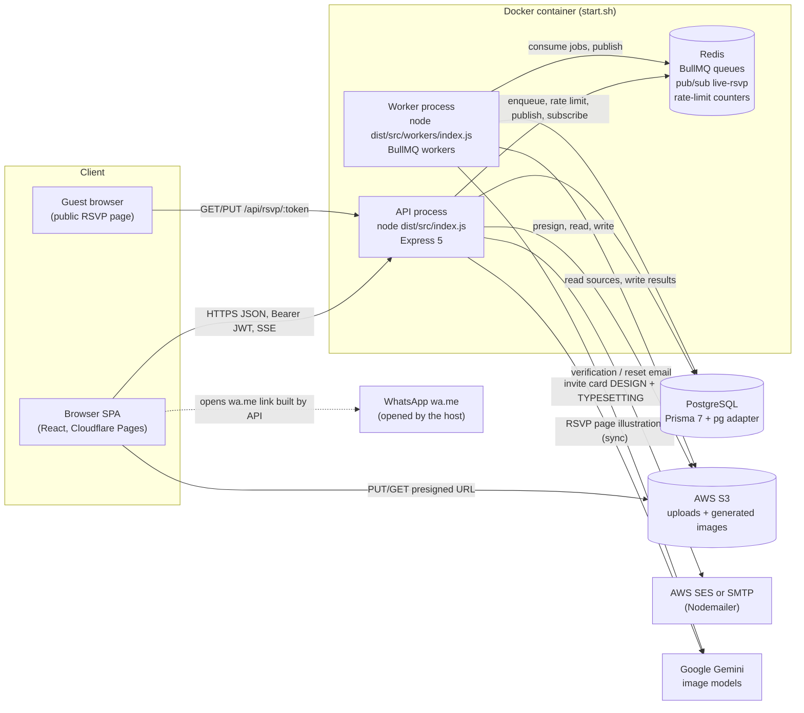
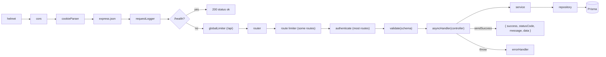
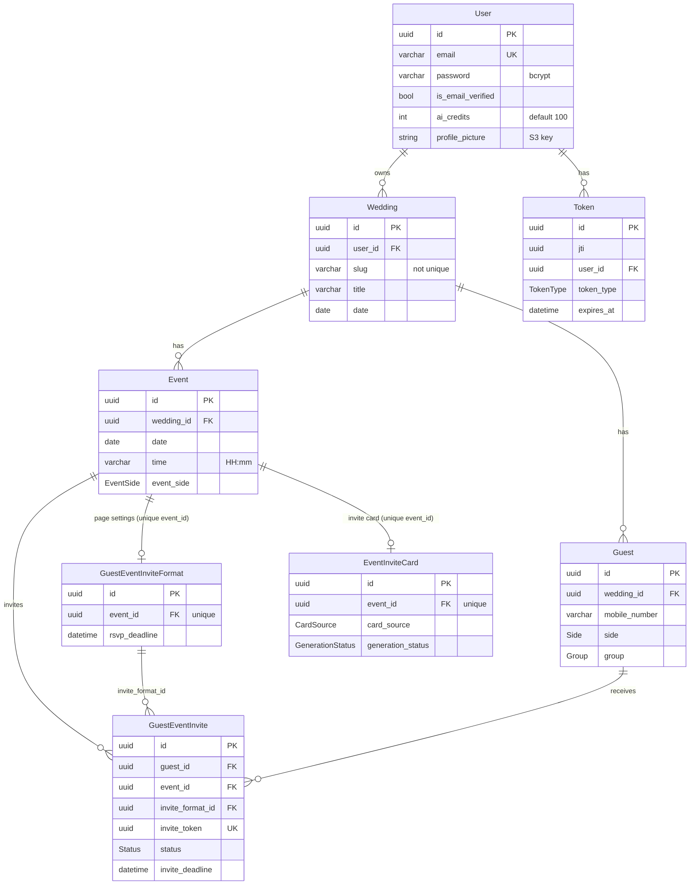
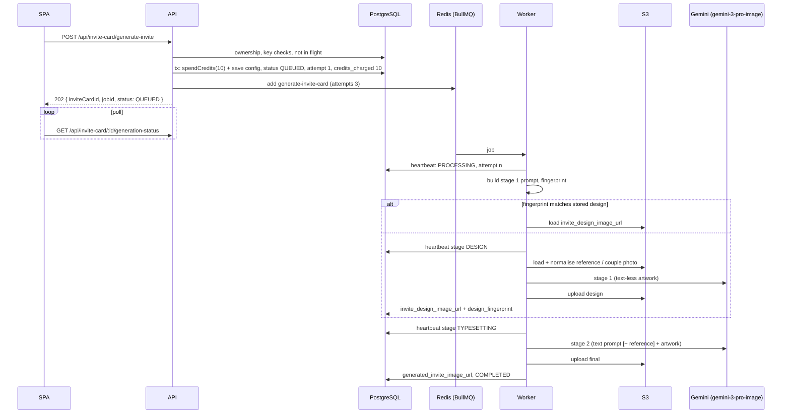
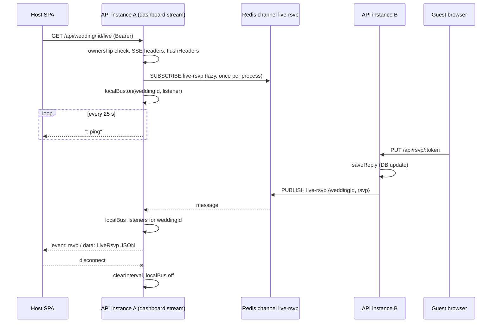

# Technical Architecture — AI Wedding RSVP Generator Backend

As of 2026-10-01. Describes the code as built; every statement links to the file it comes from. Endpoint-level detail lives in [API_SPEC.md](./API_SPEC.md).

## 1. System context

| Component | Entry point | Role |
|---|---|---|
| API process | [src/index.ts](../src/index.ts) | Express app: helmet, CORS (`WEB_APP_URL`), JSON body, request logger, `/health`, global limiter on `/api`, 8 routers, `/reference` docs, error handler. Checks DB with `SELECT 1` before listening ([prisma.ts](../src/lib/prisma.ts)). |
| Worker process | [src/workers/index.ts](../src/workers/index.ts) | Starts `guestWorker` and `inviteCardWorker`; on SIGTERM/SIGINT waits for in-flight jobs (`worker.close()`). |
| PostgreSQL | [prisma/schema.prisma](../prisma/schema.prisma) | All persistent state. Client generated to `generated/prisma`. |
| Redis | [src/lib/redis.ts](../src/lib/redis.ts) | One shared ioredis connection (`maxRetriesPerRequest: null` for BullMQ) + BullMQ's own connections + one lazy subscriber per streaming process ([rsvpEvents.ts](../src/lib/rsvpEvents.ts)). |
| S3 | [aws.service.ts](../src/services/aws.service.ts) | Presigned PUT/GET, server-side read (`getBufferFromS3`) and write (`uploadBufferToS3`). |
| Email | [email.service.ts](../src/services/email.service.ts) | SES or SMTP chosen by `EMAIL_PROVIDER`; Handlebars templates in [src/public/emailTemplates](../src/public/emailTemplates). |
| Gemini | [geminiClient.ts](../src/lib/geminiClient.ts) | Lazy singleton `GoogleGenAI`; throws if `GEMINI_API_KEY` is missing (only when first used). |

## 2. Tech stack

Versions are the ranges in [package.json](../package.json); installed versions match the lower bound.

| Area | Package | Version |
|---|---|---|
| Runtime | Node.js (Docker base `node:22-slim`) | 22 |
| Language | typescript (`strict: false`, CommonJS, [tsconfig.json](../tsconfig.json)) | ^7.0.2 |
| Dev runner | tsx | ^4.22.4 |
| HTTP | express | ^5.2.1 |
| Security headers / CORS / cookies | helmet / cors / cookie-parser | ^8.3.0 / ^2.8.6 / ^1.4.7 |
| Validation | zod (requests, env, OpenAPI) | ^4.4.3 |
| ORM | prisma, @prisma/client, @prisma/adapter-pg, pg | ^7.8.0 / ^7.8.0 / ^7.8.0 / ^8.21.0 |
| Queue | bullmq | ^5.81.1 |
| Redis client | ioredis | ^5.11.1 |
| Rate limiting | express-rate-limit, rate-limit-redis | ^8.6.1 / ^6.0.1 |
| Auth | jsonwebtoken, bcrypt, uuid, moment | ^9.0.3 / ^6.0.0 / ^14.0.0 / ^2.30.1 |
| AI | @google/genai | ^2.11.0 |
| Images | sharp | ^0.35.4 |
| AWS | @aws-sdk/client-s3, s3-request-presigner, client-ses | ^3.1084.0 / ^3.1084.0 / ^3.1077.0 |
| Email | nodemailer, handlebars | ^10.0.13 / ^4.7.9 |
| Excel | exceljs (write template/export), read-excel-file (import) | ^4.4.0 / ^9.3.4 |
| Uploads | multer (memory storage, 5 MB) | ^2.2.0 |
| Logging | pino, pino-pretty | ^10.3.1 / ^13.1.3 |
| API docs | @scalar/express-api-reference | ^0.10.8 |

Scripts ([package.json](../package.json)): `dev` (tsx watch API), `worker` (tsx watch workers), `docs:openapi`, `build` (`tsc` + copy `src/public` into `dist/src`). No test runner; assert-based self-checks: [inviteCardGeneration.check.ts](../src/utils/inviteCardGeneration.check.ts) (pure, no I/O) and [credits.check.ts](../src/utils/credits.check.ts) (hits the local DB).

## 3. Directory layout

| Path | Contents |
|---|---|
| [src/index.ts](../src/index.ts) | API bootstrap and router mounting |
| [src/config/](../src/config) | `env.ts` (zod env validation, exits on failure), `logger.ts` (pino) |
| [src/routes/](../src/routes) | One router per resource; `eventInviteFormat.route.ts` is singular |
| [src/middlewares/](../src/middlewares) | `auth`, `validate`, `error`, `logger`, `rateLimiter`, `upload` |
| [src/controllers/](../src/controllers) | Read `req`, call services, `sendSuccess` |
| [src/services/](../src/services) | Business rules, ownership checks, transactions |
| [src/repositories/](../src/repositories) | Prisma queries; each takes optional `tx` |
| [src/validations/](../src/validations) | zod schemas `{ body?, query?, params? }` + inferred DTO types |
| [src/queues/](../src/queues) | BullMQ `Queue` definitions and `add*Job` helpers |
| [src/workers/](../src/workers) | BullMQ `Worker`s and the worker entry point |
| [src/lib/](../src/lib) | Prisma, Redis, Gemini clients; live RSVP pub/sub; WhatsApp helpers |
| [src/utils/](../src/utils) | Response/error helpers, prompt builders and catalogues, Gemini wrapper, image normalisation, reminder/RSVP rules |
| [src/enums/](../src/enums) | Token types, invite-card enums and generation constants |
| [src/types/](../src/types) | `express.d.ts` (`req.user`), DTO/response types |
| [src/public/emailTemplates/](../src/public/emailTemplates) | `email-verification.html`, `forgot-password.html` |
| [src/openapi.json](../src/openapi.json) | Generated OpenAPI 3.1 document |
| [scripts/generate-openapi.ts](../scripts/generate-openapi.ts) | Route table + zod → OpenAPI generator |
| [prisma/](../prisma) | `schema.prisma`, 50 migrations (2026-06-12 → 2026-09-24) |
| [dockerfile](../dockerfile), [start.sh](../start.sh) | Single-container deployment |

## 4. Request pipeline

| Stage | File | Behaviour |
|---|---|---|
| `authenticate` | [auth.middleware.ts](../src/middlewares/auth.middleware.ts) | Requires `Authorization: Bearer <jwt>`; `verifyTokenService(token, ACCESS)` checks JWT signature, a `Token` row with that `jti` and type, and DB expiry; loads the user, strips `password`, sets `req.user`. Any failure → `401 "Please authenticate"`. |
| `validate` | [validate.middleware.ts](../src/middlewares/validate.middleware.ts) | `schema.parseAsync({ body, query, params })`; writes parsed values back to `req` (so defaults/transforms apply). ZodError → `400 { success:false, message:"<path>: <msg>", errors: issues }` (no `statusCode` field). |
| `asyncHandler` | [asyncHandler.util.ts](../src/utils/asyncHandler.util.ts) | Forwards rejected promises to `next`. |
| Controller | [src/controllers](../src/controllers) | Calls services; responds with `sendSuccess(res, message, data, status)`. |
| Service | [src/services](../src/services) | Ownership checks and business rules; multi-step writes in `prisma.$transaction(async (tx) => …)`. |
| Repository | [src/repositories](../src/repositories) | Plain functions; `const db = tx \|\| prisma`. |

### Response envelope and errors

| Case | Shape | Source |
|---|---|---|
| Success | `{ success: true, statusCode, message, data }` | `sendSuccess` in [response.util.ts](../src/utils/response.util.ts) |
| `ApiError(status, msg)` thrown anywhere | `{ success: false, statusCode: status, message, errors: undefined }` | [apiError.util.ts](../src/utils/apiError.util.ts), [error.middleware.ts](../src/middlewares/error.middleware.ts) |
| Any other error (Prisma, TypeError, multer, JSON parse) | `500 { success:false, statusCode:500, message:"Something went wrong! Please try again later" }` | [error.middleware.ts](../src/middlewares/error.middleware.ts) |
| Validation | `400 { success:false, message, errors }` | [validate.middleware.ts](../src/middlewares/validate.middleware.ts) |
| Rate limit | `429 { success:false, message }` + `RateLimit-*` standard headers | [rateLimiter.middleware.ts](../src/middlewares/rateLimiter.middleware.ts) |
| Unknown route | Express default 404 (no JSON handler registered) | [index.ts](../src/index.ts) |

All errors are logged with method and URL by the error handler.

### Ownership model

No middleware enforces ownership; each service/controller does. Helpers:

| Helper | File | Check |
|---|---|---|
| `getUserWeddingService(userId, weddingId)` | [wedding.service.ts](../src/services/wedding.service.ts) | `wedding.findUnique({ id, user_id })`, else `404 Wedding not found` |
| `verfiyWeddingOwnershipService(userId, weddingId)` (sic) | [wedding.service.ts](../src/services/wedding.service.ts) | Same query, returns boolean |
| `verifyWeddingEventOwnershipService(eventId, userId)` | [event.service.ts](../src/services/event.service.ts) | `event.findFirst({ id, wedding: { user_id } })` |
| `findGuestEventInviteForUser(inviteId, userId)` | [guest.repository.ts](../src/repositories/guest.repository.ts) | `guestEventInvite.findFirst({ id, event: { wedding: { user_id } } })` |
| Job owner | [guest.service.ts](../src/services/guest.service.ts) `getGuestImportStatusService` | `job.data.userId === userId`, else 404 |
| S3 keys on writes | [imageKeyOwnership.util.ts](../src/utils/imageKeyOwnership.util.ts) `assertOwnedImageKeys` | New key must be under `users/<userId>/` or equal the stored value, else `400 Invalid image for <field>` |

## 5. Data model

### Entity-relationship diagram

All relations use `onDelete: Cascade`: deleting a user removes weddings/tokens; a wedding removes events/guests; an event removes invites, page settings and card; a guest removes invites. Ids are `gen_random_uuid()`; `created_at`/`updated_at` default `now()` as `timestamptz(6)`. There is no `@updatedAt`; repositories set `updated_at` manually on event, wedding, page-setting, card and invite updates, but not on user or guest updates ([user.repository.ts](../src/repositories/user.repository.ts), [guest.repository.ts](../src/repositories/guest.repository.ts)).

### Models

Source: [schema.prisma](../prisma/schema.prisma).

**User**

| Field | Type | Notes |
|---|---|---|
| `id` | uuid PK | |
| `first_name`, `last_name` | varchar(256) | |
| `email` | varchar(256) unique, indexed | |
| `is_email_verified` | bool, default false | Sign-in blocked until true |
| `mobile_number` | varchar(256) | Not validated |
| `password` | varchar(256) | bcrypt, cost 10 |
| `profile_picture` | string? | S3 key |
| `ai_credits` | int, default 100 | Decremented per generation ([credits.service.ts](../src/services/credits.service.ts)) |
| Relations | `weddings`, `tokens` | |

**Token**

| Field | Type | Notes |
|---|---|---|
| `jti` | uuid, indexed (not unique) | Matches the JWT `jti` claim |
| `user_id` | FK → User, indexed | |
| `token_type` | `TokenType` default `ACCESS` | |
| `expires_at` | DateTime | Checked in addition to JWT `exp` |

**Wedding**

| Field | Type | Notes |
|---|---|---|
| `user_id` | FK → User, indexed | Owner |
| `slug` | varchar(256), not unique | `title` lowercased, non `[a-z0-9]` → `-`; recomputed on title change ([wedding.service.ts](../src/services/wedding.service.ts)). Cosmetic in RSVP URLs. |
| `title`, `bride_name`, `groom_name`, `city` | varchar(256) | |
| `date` | date | |
| `venue`, `address` | text | |
| `message` | string? | |
| Relations | `events`, `guests` | |

**Event**

| Field | Type | Notes |
|---|---|---|
| `wedding_id` | FK → Wedding, indexed | |
| `title` | varchar(256), indexed | |
| `description` | varchar(256) | Validation caps at 250 |
| `date` | date | |
| `time` | varchar(256) | `HH:mm` string |
| `venue`, `address` | text | |
| `latitude`, `longitude` | varchar(256)? | Strings, not numerics |
| `city` | varchar(256) | |
| `event_side` | `EventSide` | |
| Relations | `guestEventInvite[]`, `guestEventInviteFormat[]`, `inviteCard[]` | Arrays in Prisma, but the latter two are 1:1 via `@@unique([event_id])`; created together with the event ([event.service.ts](../src/services/event.service.ts)) |

**Guest**

| Field | Type | Notes |
|---|---|---|
| `wedding_id` | FK → Wedding | `@@unique([wedding_id, id])` (redundant with PK) |
| `name` | varchar(256), indexed | |
| `email` | varchar(256)? | Blank stored as null |
| `mobile_number` | varchar(256)?, indexed | Stored as typed; used as the dedupe key within a wedding on create |
| `side` | `Side` | |
| `group` | `Group` | |
| `accomodation_required` | bool default false | Misspelled, part of API |
| `accomodation_address` | varchar(256)? | Misspelled, part of API |
| `note` | varchar(256)? | |

**GuestEventInvite** — one per (guest, event), `@@unique([guest_id, event_id])`

| Field | Type | Notes |
|---|---|---|
| `guest_id`, `event_id` | FKs, indexed | |
| `invite_format_id` | FK → GuestEventInviteFormat | Set from the event's format on create |
| `invite_token` | uuid unique | Sole credential of the public RSVP link |
| `status` | `Status` default `PENDING` | |
| `plus_ones` | int? | |
| `dietary` | `Dietary`? | |
| `song_request`, `message` | string? | |
| `invite_deadline` | DateTime? | Copy of the format's `rsvp_deadline`; enforced on guest submit |
| `responded_at` | timestamptz? | Set on every reply |
| `invite_sent_at` | timestamptz? | Set by `mark-sent` |
| `first_reminder_sent_at`, `final_reminder_sent_at` | timestamptz? | Set by `mark-reminded` |

**GuestEventInviteFormat** — per-event RSVP page settings (API name: page-setting)

| Field | Type | Notes |
|---|---|---|
| `event_id` | FK, `@@unique` and `@@index` | |
| `raw_image`, `generated_image` | string? | S3 keys (source photo, generated illustration) |
| `illustration_style`, `illustration_theme`, `photo_type`, `bride_attire_style`, `groom_attire_style` | string? | Illustration settings |
| `dietary_preference`, `song_request`, `message`, `plus_ones` | bool default false | Which questions the RSVP page asks; replies to disabled questions are dropped ([rsvp.util.ts](../src/utils/rsvp.util.ts)) |
| `first_reminder`, `final_reminder` | bool default false | Reminder toggles |
| `rsvp_deadline` | timestamptz? | Copied to all invites on save |

**EventInviteCard** — per-event invitation card (renamed from `AIEventInviteCard` in migration `20260922110000`)

| Field group | Fields | Notes |
|---|---|---|
| Source | `card_source` (`CardSource`, default `EXAMPLE`) | PRESETS / EXAMPLE generate; UPLOAD is the couple's own image |
| Preset design | `design_preset`, `texture_emulation`, `typography_pairing`, `metallic_accents`, `negative_space`, `monogram_style`, `text_alignment`, `edge_styling`, `additional_details`, `custom_message` | Keys into [manualDesignCatalogue.util.ts](../src/utils/manualDesignCatalogue.util.ts) (unknown keys pass through as text) |
| Images (S3 keys) | `reference_image`, `generated_image`, `couple_raw_image_key`, `generated_invite_image_url`, `invite_design_image_url` | `*_url` columns hold keys, not URLs |
| Photo | `photo_type` (`couple`/`bride`/`groom`), `photo_placement` (`PhotoPlacement`), `illustration_style`, `bride_attire_style`, `groom_attire_style` | Attire ids from [attireCatelogue.util.ts](../src/utils/attireCatelogue.util.ts) |
| Pipeline state | `design_fingerprint`, `generation_status` (default `IDLE`), `generation_stage`, `generation_job_id`, `generation_error`, `generation_error_code`, `generation_attempt`, `generation_heartbeat_at`, `generation_started_at`, `generation_completed_at` | See section 6 |
| Billing | `credits_charged` int default 0 | Cleared on refund so only one refund happens |

### Enums

| Enum | Values |
|---|---|
| `TokenType` | ACCESS, REFRESH, EMAIL_VERIFICATION, RESET_PASSWORD |
| `Side` | BRIDE, GROOM, BOTH |
| `EventSide` | BRIDE, GROOM, BOTH (duplicate of `Side`) |
| `Status` | PENDING, ATTENDING, DECLINED, MAYBE |
| `Dietary` | VEGAN, VEGETARIAN, NON_VEGETARAIN, EGGETARIAN, LACTOSE_FREE, GLUTEN_FREE, OTHER |
| `Group` | FAMILY, FRIEND, RELATIVE, COLLEAGUE, EMPLOYEE, VIP, OTHER |
| `CardSource` | PRESETS, EXAMPLE, UPLOAD |
| `PhotoPlacement` | SWAP_IN_PLACE, FRAMED_INSET |
| `GenerationStatus` | IDLE, QUEUED, PROCESSING, COMPLETED, FAILED |

Code-only enums in [inviteCard.enum.ts](../src/enums/inviteCard.enum.ts): `GENERATION_STAGE` (DESIGN, TYPESETTING), `GENERATION_ERROR_CODE` (OVERLOADED, RATE_LIMITED, TIMEOUT, NO_IMAGE, SAFETY_BLOCKED, BILLING, INVALID_INPUT, UNKNOWN).

### Misspellings that are part of the API/schema

| Name | Where |
|---|---|
| `accomodation_required`, `accomodation_address` | Guest columns and request fields |
| `NON_VEGETARAIN` | `Dietary` enum value |
| `verfiyWeddingOwnershipService` | [wedding.service.ts](../src/services/wedding.service.ts) |
| `attireCatelogue`, `styleCatelogue` | [src/utils](../src/utils) file names |
| `geteventInviteFormat`, `getEventinviteFormatService`, `getEventInviteFormatByeventSchema`, `getAiInvitecardsByWeddingSchema` | Controller/service/schema names |
| `eventInviteFormat.route.ts` | Singular, unlike other route files |

## 6. Background jobs

The API enqueues and returns `202`; the worker runs a service function whose return value becomes the job result.

| Queue | Name | Job name / payload | Options | Worker | Status source |
|---|---|---|---|---|---|
| Guest import | `guest-import-queue` ([guest.queue.ts](../src/queues/guest.queue.ts)) | `parse-excel` `{ type:"parse-excel", userId, weddingId, filePath }` (union on `type`) | BullMQ default attempts (1); `removeOnComplete:false`, `removeOnFail:false` (kept in Redis indefinitely) | [guest.worker.ts](../src/workers/guest.worker.ts), concurrency 1 | BullMQ job: `GET /api/guest/import-status/:jobId` |
| Invite card | `ai-invite-card-queue` ([inviteCard.queue.ts](../src/queues/inviteCard.queue.ts)) | `generate-invite-card` `{ type, inviteCardId, eventId, userId }` | `attempts: 3`, `backoff: custom` (worker strategy 30 s then 90 s), keep completed/failed 24 h / 500 | [inviteCard.worker.ts](../src/workers/inviteCard.worker.ts), concurrency 1 | `EventInviteCard` row: `GET /api/invite-card/:id/generation-status` |

### Guest import flow

| Step | Where | Detail |
|---|---|---|
| 1 | `POST /api/guest/template/upload/:id` | multer memory upload (`file`, 5 MB). Buffer written to `os.tmpdir()/guest-import-<uuid>.xlsx`; job enqueued. Wedding ownership is not checked at this point ([guest.service.ts](../src/services/guest.service.ts) `importGuestListTemplateService`). |
| 2 | Worker `parseGuestListTemplateJob` | Reads hidden `_meta` sheet (`weddingId`, `eventMapJSON`, `fieldColMapJSON`); rejects a template whose `weddingId` differs. Reads `Guest List` from row 8, skips empty rows and repeated mobiles within the file. |
| 3 | Per row | Parses with `addNewGuestBodySchema`, then `addNewGuestService(userId, …)`, which checks every event belongs to the user. Progress 10→100 via `job.updateProgress`. |
| 4 | Result | `{ totalProcessed, successful, failed, errors: [{ row, error }] }`; temp file deleted on success. The temp file path requires the API and worker to share a filesystem (true in the single container). |

### AI invite card pipeline

| Aspect | Rule | Source |
|---|---|---|
| Model | `gemini-3-pro-image`, aspect 9:16, `responseModalities [TEXT, IMAGE]` | [inviteCard.enum.ts](../src/enums/inviteCard.enum.ts), [geminiImage.util.ts](../src/utils/geminiImage.util.ts) |
| Stages | DESIGN (text-less artwork) → TYPESETTING (adds wedding text); card is COMPLETED only after TYPESETTING saved a final image | [inviteCardGeneration.service.ts](../src/services/inviteCardGeneration.service.ts) |
| Prompts | Stage 1: `buildStage1ExamplePrompt` / `buildStage1ManualPrompt`; stage 2: `buildStage2TextPrompt` | [inviteCardPromptBuilder.util.ts](../src/utils/inviteCardPromptBuilder.util.ts) |
| Stage 1 images | EXAMPLE: `reference_image`; both modes: `couple_raw_image_key` when `photo_type` is set | `getStage1ImageKeys` |
| Fingerprint reuse | `sha256(JSON([model, stage1Prompt, [referenceKey, subjectKey]]))`; DESIGN skipped when `invite_design_image_url` exists and fingerprint matches. Job retries, "Try again" and text-only edits reuse the artwork. | [inviteCardGeneration.util.ts](../src/utils/inviteCardGeneration.util.ts) |
| Source normalisation | sharp: EXIF rotate, longest side ≤ 2048 px, PNG if alpha else JPEG q90; > 20 MB or undecodable → INVALID_INPUT; S3 `NoSuchKey` → INVALID_INPUT; S3 read timeout 30 s | [imageNormalize.util.ts](../src/utils/imageNormalize.util.ts), `fetchImageAsGeminiPart` |
| Per-call timeout | `AbortSignal.timeout(120 s)` | `generateImage` |
| In-call retry | Only `OVERLOADED`, waits 2 s then 6 s (±20 % jitter), heartbeat on each retry | `generateImage` |
| Job retry | 3 attempts; delays 30 s, 90 s; retryable codes: OVERLOADED, RATE_LIMITED, TIMEOUT, NO_IMAGE, UNKNOWN; others throw `UnrecoverableError` | [inviteCard.service.ts](../src/services/inviteCard.service.ts) `runInviteCardGenerationJob`, [inviteCard.worker.ts](../src/workers/inviteCard.worker.ts) |
| While waiting to retry | Card set back to QUEUED with `generation_attempt = attempt + 1` and last error recorded | `runInviteCardGenerationJob` |
| Heartbeat | `generation_heartbeat_at` written at start, each stage, each in-call retry, and at end | `runInviteCardGenerationJob` |
| Stale sweep | Status endpoint marks QUEUED/PROCESSING cards with no heartbeat for 10 min as FAILED/TIMEOUT and refunds | `getInviteCardGenerationStatusService`, `GENERATION_STALE_AFTER_MS` |
| Concurrency guard | New request rejected `409` while a non-stale card is QUEUED/PROCESSING | `isGenerationInFlight` |
| Credits | 10 charged up front in the same transaction as the QUEUED write; refunded once (`credits_charged` cleared conditionally) on final failure, enqueue failure, or stale sweep | [credits.service.ts](../src/services/credits.service.ts) |
| Output keys | `ai-invite-cards/generated-images/invitation-design/<uuid>.<ext>` and `.../final-invitation/<uuid>.<ext>` (not under the user prefix; viewable through the DB-reference rule) | [inviteCardGeneration.service.ts](../src/services/inviteCardGeneration.service.ts) |

Error classification (`classifyGeminiError`, [geminiImage.util.ts](../src/utils/geminiImage.util.ts)):

| Condition | Code | Retryable |
|---|---|---|
| `AbortError` / `TimeoutError` | TIMEOUT | yes |
| HTTP 429 or `RESOURCE_EXHAUSTED`, message matches `/credit/i` | BILLING | no |
| HTTP 429 or `RESOURCE_EXHAUSTED`, otherwise | RATE_LIMITED | yes |
| HTTP 500/502/503/504, network codes (ECONNRESET, ETIMEDOUT, …), `fetch failed` | OVERLOADED | yes |
| HTTP 400 | INVALID_INPUT | no |
| `promptFeedback.blockReason` or safety finish reasons | SAFETY_BLOCKED | no |
| No inline image in response | NO_IMAGE | yes |
| Anything else (including unknown attire/style ids, which throw plain `Error`) | UNKNOWN | yes |

### RSVP page illustration (synchronous, not queued)

`POST /api/page-setting/generate-image` runs inline in the API ([eventInviteFormat.service.ts](../src/services/eventInviteFormat.service.ts)): ownership + key check, read the raw image from S3, `spendCredits(5)`, `pageSettingEditImageWithGemini` (model `gemini-3.1-flash-image`, aspect 1:1, `retryWithBackoff` 3 tries on 500/503, [geminiImageEditor.util.ts](../src/utils/geminiImageEditor.util.ts)), upload to `users/<userId>/generated-images/rsvp-generated-images/<uuid>.png`, refund on any failure. The caller saves the returned key onto the page settings with `PATCH /api/page-setting/:id`.

## 7. Live RSVP updates

| Aspect | Detail | Source |
|---|---|---|
| Publisher | `emitRsvp(weddingId, rsvp)` after the reply is saved, from both guest and host reply paths (`saveReply`) | [rsvp.service.ts](../src/services/rsvp.service.ts) |
| Channel | `live-rsvp`, message `{ weddingId, rsvp: LiveRsvp }` | [rsvpEvents.ts](../src/lib/rsvpEvents.ts) |
| Failure policy | Publish is fire-and-forget; errors are logged, never thrown | `emitRsvp` |
| Subscriber | One dedicated ioredis connection per process, opened on first `onRsvp`; each listener called in its own try/catch | `ensureSubscribed` |
| Payload `LiveRsvp` | `{ inviteId, guestName, eventTitle, status: "ATTENDING" \| "MAYBE" \| "DECLINED", plusOnes, respondedAt }` | `toLiveRsvp` |
| Headers | `text/event-stream`, `Cache-Control: no-cache, no-transform`, `Connection: keep-alive`, `X-Accel-Buffering: no` | [wedding.controller.ts](../src/controllers/wedding.controller.ts) |
| Heartbeat | `: ping` every 25 s (Cloudflare idle limit 100 s) | `streamWeddingLive` |
| Dashboard seed | `GET /api/wedding/:id/dashboard` returns the last 10 replies in the same `LiveRsvp` shape (`recentRsvps`) | [wedding.service.ts](../src/services/wedding.service.ts) |

## 8. External integrations

### S3

| Concern | Rule | Source |
|---|---|---|
| Client | `S3Client({ region: AWS_S3_REGION, credentials })`; with `AWS_S3_REGION` unset the SDK uses `AWS_REGION` | [aws.service.ts](../src/services/aws.service.ts), [env.ts](../src/config/env.ts) |
| Upload | Client asks `POST /api/general/generate-upload-url` → key rewritten to `users/<userId>/<requested key>` unless already prefixed → presigned `PutObject` with `ContentType = mime_type` → client PUTs directly to S3 and saves the returned `object_key` | [general.service.ts](../src/services/general.service.ts) |
| View | `POST /api/general/generate-view-url`: allowed if key starts with the caller's prefix or `isObjectKeyReferencedByUser` (user `profile_picture`, page-setting `raw_image`/`generated_image`, card `reference_image`/`generated_image`/`couple_raw_image_key`/`generated_invite_image_url`/`invite_design_image_url` on records the user owns); otherwise 404 | [general.repository.ts](../src/repositories/general.repository.ts) |
| Writing keys onto records | `assertOwnedImageKeys` on page-setting (`raw_image`, `generated_image`) and card (`reference_image`, `generated_image`, `couple_raw_image_key`, `generated_invite_image_url`) updates and on generation | [imageKeyOwnership.util.ts](../src/utils/imageKeyOwnership.util.ts) |
| Public RSVP page | Guest has no session, so `GET /api/rsvp/:token` returns presigned GET URLs (`invite_card_url`, `format.illustration_url`); signing failure yields `null` | [rsvp.service.ts](../src/services/rsvp.service.ts) |
| Expiry | Both PUT and GET presigned URLs use `AWS_BUCKET_PUT_URL_EXPIRE` seconds | [general.service.ts](../src/services/general.service.ts), [rsvp.service.ts](../src/services/rsvp.service.ts) |

### Email

| Concern | Detail | Source |
|---|---|---|
| Provider | `EMAIL_PROVIDER=ses` → `SendEmailCommand` with SES creds; `smtp` → Nodemailer (`secure` when port 465); sender is `SMTP_USER` or `AWS_SENDER_EMAIL`, display name `PROJECT_NAME` | [email.service.ts](../src/services/email.service.ts) |
| Templates in use | Verification (`email-verification.html`, link `WEB_APP_URL/verify-email?token=…`), forgot password (`forgot-password.html`, link `WEB_APP_URL/reset-password?token=…`) | [email.service.ts](../src/services/email.service.ts), [utils.ts](../src/utils/utils.ts) `createUrl` |
| Unused branches | `welcome.html`, `email-verification-success.html`, `reset-password-success.html`, `user-with-credentials.html`, `staff-created.html` are referenced but do not exist and no caller uses them | [email.constant.ts](../src/utils/constants/email.constant.ts) |
| Failure policy | `sendEmail` catches everything and returns `false`; callers do not check it | [auth.service.ts](../src/services/auth.service.ts) |

### WhatsApp (no API)

| Concern | Rule | Source |
|---|---|---|
| Phone normalisation | Strip non-digits and leading zeros; < 8 digits → invalid; no `+` and ≤ 10 digits → prefix `WHATSAPP_DEFAULT_COUNTRY_CODE` | [whatsapp.ts](../src/lib/whatsapp.ts) `normalizePhone` |
| Link | `https://wa.me/<digits>?text=<urlencoded message>` | `buildWhatsAppLink` |
| RSVP URL | `WEB_APP_URL/rsvp/<wedding slug or "invite">/<invite_token>` | [guest.service.ts](../src/services/guest.service.ts) `buildRsvpUrl` |
| Invite message | Guest name, couple names, event title, date (en-GB, UTC), time, venue, RSVP URL | `formatInviteMessage` |
| Sent tracking | Host clicks → frontend calls `mark-sent` → `invite_sent_at = now` (cannot confirm the message was actually sent) | `markInviteSentService` |
| Guest validation | `mobile_number` must pass `normalizePhone` on create | [guest.validations.ts](../src/validations/guest.validations.ts) |

### Reminder rules ([reminder.util.ts](../src/utils/reminder.util.ts))

| Rule | Condition |
|---|---|
| Eligible at all | `status = PENDING`, `invite_sent_at` set, and deadline not passed |
| FINAL (checked first) | `final_reminder` toggle on, `invite_deadline` set, final not yet sent, deadline within 3 days |
| FIRST | `first_reminder` toggle on, neither reminder sent, ≥ 7 days since `invite_sent_at` |
| Marking | `POST /api/guest/invites/:inviteId/mark-reminded { reminder: FIRST \| FINAL }` sets the matching `*_reminder_sent_at` |

### RSVP deadline

`PATCH /api/page-setting/:id` with `rsvp_deadline` updates the format and, in the same transaction, every invite's `invite_deadline` (`setInviteDeadlineForFormat`, [eventInviteFormat.repository.ts](../src/repositories/eventInviteFormat.repository.ts)). New invites copy the format's deadline on create. Guest submissions after `invite_deadline` → `409 RSVPs for this event are closed`; the host path ignores the deadline ([rsvp.util.ts](../src/utils/rsvp.util.ts)).

### AI credits

| Action | Cost | Source |
|---|---|---|
| Invite card generation | 10 | `AI_CREDIT_COST.INVITE_CARD` |
| RSVP page illustration | 5 | `AI_CREDIT_COST.HEADER_IMAGE` |
| Insufficient balance | `402 Not enough AI credits. This needs N credits.` (atomic `updateMany … where ai_credits >= cost`) | [credits.service.ts](../src/services/credits.service.ts) |

## 9. Authentication and tokens

| Token | Lifetime (env) | Stored | Used by |
|---|---|---|---|
| ACCESS | `JWT_ACCESS_EXPIRATION_MINUTES` | `Token` row | `authenticate` |
| REFRESH | `JWT_REFRESH_EXPIRATION_DAYS` | `Token` row | `/auth/access-token`, `/auth/logout` |
| EMAIL_VERIFICATION | `JWT_VERIFY_EMAIL_EXPIRATION_MINUTES` (default 10) | `Token` row | `/auth/verify-email` |
| RESET_PASSWORD | `JWT_RESET_PASSWORD_EXPIRATION_MINUTES` (default 10) | `Token` row | `/auth/reset-password` |

All are HS256 JWTs `{ sub, jti, exp }` signed with `JWT_SECRET` ([token.service.ts](../src/services/token.service.ts)). Sign-in and refresh both delete every token of the user before issuing a new pair, so there is one active session per user; signing in on a second device invalidates the first. Refresh rotates both tokens. Tokens are returned in the JSON body; no cookies are set (cookie-parser is mounted but unused).

## 10. Configuration

Validated once at startup by [env.ts](../src/config/env.ts) (imported first by both entry points); invalid config prints every problem and exits 1. Code still reads `process.env` directly.

| Variable | Required | Default | Purpose |
|---|---|---|---|
| `NODE_ENV` | no | `development` | `local` disables all rate limiters ([rateLimiter.middleware.ts](../src/middlewares/rateLimiter.middleware.ts)); `.env.example` sets `local` |
| `PORT` | no | 3000 | API port |
| `DATABASE_URL` | yes | | PostgreSQL connection (pg Pool, Prisma config) |
| `WEB_APP_URL` | yes (URL) | | CORS origin (no trailing slash) and base for email/RSVP links |
| `JWT_SECRET` | yes | | HS256 signing key |
| `JWT_ACCESS_EXPIRATION_MINUTES` | yes | | Access token lifetime |
| `JWT_REFRESH_EXPIRATION_DAYS` | yes | | Refresh token lifetime |
| `JWT_RESET_PASSWORD_EXPIRATION_MINUTES` | no | 10 (in code) | Reset link lifetime |
| `JWT_VERIFY_EMAIL_EXPIRATION_MINUTES` | no | 10 (in code) | Verification link lifetime |
| `AWS_ACCESS_KEY_ID`, `AWS_SECRET_ACCESS_KEY` | yes | | S3 credentials |
| `AWS_S3_REGION` / `AWS_REGION` | one of them | | S3 region |
| `AWS_BUCKET_NAME` | yes | | Bucket |
| `AWS_BUCKET_PUT_URL_EXPIRE` | yes (int) | | Presigned URL lifetime in seconds (PUT and GET) |
| `AWS_BUCKET_GET_URL_EXPIRE` | not validated | | In `.env.example` only; no code reads it |
| `EMAIL_PROVIDER` | no | `ses` | `ses` or `smtp` |
| `AWS_SES_ACCESS_KEY_ID`, `AWS_SES_SECRET_ACCESS_KEY`, `AWS_SES_REGION`, `AWS_SENDER_EMAIL` | when `ses` | | SES sender |
| `SMTP_HOST`, `SMTP_USER`, `SMTP_PASS` | when `smtp` | | SMTP sender |
| `SMTP_PORT` | no | 587 (in code) | 465 enables TLS |
| `PROJECT_NAME` | yes | | Email display name |
| `GEMINI_API_KEY` | no | | Required only when generating images |
| `REDIS_HOST`, `REDIS_PORT`, `REDIS_PASSWORD` | no | `127.0.0.1`, `6379`, none | Redis connection ([redis.ts](../src/lib/redis.ts)) |
| `WHATSAPP_DEFAULT_COUNTRY_CODE` | no | empty | 1–4 digits prefixed to local numbers |

Other fixed configuration: `app.set("trust proxy", 1)` so `req.ip` (rate-limit key) is the client IP behind one proxy ([index.ts](../src/index.ts)).

## 11. Deployment and operations

| Concern | Detail | Source |
|---|---|---|
| Image | `node:22-slim`; `npm install` (incl. dev deps); `apt-get install redis-server`; `npx prisma generate`; `npm run build`; `EXPOSE 3000`; runs as `node` | [dockerfile](../dockerfile) |
| Processes | `start.sh`: `redis-server --daemonize yes` (no password), worker in background, API in background; `wait -n` exits the container with the first process's exit code; TERM/INT forwarded to both Node processes | [start.sh](../start.sh) |
| Migrations | Not run by the image or `start.sh`; apply `prisma migrate deploy` separately | [dockerfile](../dockerfile), [start.sh](../start.sh) |
| Build output | `tsc` with `rootDir ./` → `dist/src/...`; templates copied to `dist/src/public` | [package.json](../package.json), [tsconfig.json](../tsconfig.json) |
| Logging | pino level `info`, multistream: pretty console + `./logs/app.log` (Docker creates `/app/logs`). Request logger logs method, URL, status, duration, IP, UA; `>= 400` at error level. Pipeline logs `generation.start/stage/retry/end` with `cardId`, `jobId`, `attempt`. | [logger.ts](../src/config/logger.ts), [logger.middleware.ts](../src/middlewares/logger.middleware.ts) |
| Health | `GET /health` → `200 { status:"ok", timestamp }`, before the rate limiter; does not check DB or Redis | [index.ts](../src/index.ts) |
| API docs | `/reference` serves Scalar (theme purple) over `src/openapi.json` | [index.ts](../src/index.ts) |
| OpenAPI generation | `npm run docs:openapi` → [generate-openapi.ts](../scripts/generate-openapi.ts): route table (49 routes) + each route's zod schema (`z.toJSONSchema`, `io: "input"`) + `/health`; writes 50 operations. Adding a route requires adding it to the table. | [generate-openapi.ts](../scripts/generate-openapi.ts) |

## 12. Conventions and quirks

| Topic | Detail | Source |
|---|---|---|
| Shortcuts | Deliberate limits are marked `// ponytail:` (e.g. env validated but not consumed, dashboard window uses server timezone, `mark-sent` on click, HEIC unsupported) | [env.ts](../src/config/env.ts), [wedding.service.ts](../src/services/wedding.service.ts), [guest.service.ts](../src/services/guest.service.ts), [imageNormalize.util.ts](../src/utils/imageNormalize.util.ts) |
| Prisma imports | From `generated/prisma/client` or `/enums`, not `@prisma/client` | [schema.prisma](../prisma/schema.prisma) generator |
| Migrations | `YYYYMMDDHHMMSS_snake_case`; recent ones start with an explanatory SQL comment | [prisma/migrations](../prisma/migrations) |
| Inconsistent not-found statuses | Wedding 404; event not owned 400; guest not found/not owned 403; page-setting 400 or 404 depending on route; card 404/400 | services |
| Partial updates that are not partial | `PATCH /api/page-setting/:id`: omitted booleans default to `false`. `PATCH /api/guest/:id`: omitted `accomodation_required` defaults to `false`, omitted `eventIds` is treated as `[]` and removes every invite of the guest | [eventInviteFormat.validation.ts](../src/validations/eventInviteFormat.validation.ts), [guest.validations.ts](../src/validations/guest.validations.ts), [guest.service.ts](../src/services/guest.service.ts) |
| 204 with body | `resend-verify-email` and `forgot-password` call `sendSuccess(…, 204)`; Express drops the body | [auth.controller.ts](../src/controllers/auth.controller.ts) |
| Auth error mapping | `refreshTokenService` and `logoutService` do not catch `verifyTokenService`'s plain `Error`, so a bad/expired refresh token returns 500, not 401 | [auth.service.ts](../src/services/auth.service.ts) |
| Forgot password, unknown email | Transaction returns `undefined`, destructuring throws → 500 (known emails → 204) | [auth.service.ts](../src/services/auth.service.ts) |
| Sign-up, unverified existing email | Passes the 409 check, then `createUser` violates the unique email → 500 | [auth.service.ts](../src/services/auth.service.ts) |
| Profile update response | `PATCH /api/auth/me` returns the full `User` row including the bcrypt `password` hash | [auth.service.ts](../src/services/auth.service.ts), [user.repository.ts](../src/repositories/user.repository.ts) |
| Profile picture key | `profilePicture` is not checked with `assertOwnedImageKeys`, yet `profile_picture` counts as a reference in `isObjectKeyReferencedByUser`, so any key saved there becomes viewable by that user | [auth.controller.ts](../src/controllers/auth.controller.ts), [general.repository.ts](../src/repositories/general.repository.ts) |
| Import ownership | Upload endpoint does not verify the wedding; the worker's per-row event ownership check is what blocks foreign data | [guest.service.ts](../src/services/guest.service.ts) |
| Guest dedupe | Create reuses an existing guest with the exact same `mobile_number` string in the wedding and ignores the other submitted fields | `addNewGuestService` |
| Event delete | Also deletes guests of that wedding left with no invites | [event.service.ts](../src/services/event.service.ts) |
| Wedding list without `stats=true` | Ignores `search`, `filter`, `sortBy`, `sortOrder` | [wedding.service.ts](../src/services/wedding.service.ts) |
| Multer / JSON errors | Oversized upload or malformed JSON surface as generic 500 | [error.middleware.ts](../src/middlewares/error.middleware.ts) |
| Illustration generate limit | `POST /api/page-setting/generate-image` has no `imageGenerationLimiter` (only the global one) | [eventInviteFormat.route.ts](../src/routes/eventInviteFormat.route.ts) |
| Debug output | `console.log` of the profile payload in controller and service | [auth.controller.ts](../src/controllers/auth.controller.ts), [auth.service.ts](../src/services/auth.service.ts) |
| Dead code | `faceSwap.service.ts` (unused), `findGuestByMobileNumber`, `str`, `colLetterToNum` | [faceSwap.service.ts](../src/services/faceSwap.service.ts), [utils.ts](../src/utils/utils.ts) |
| CLAUDE.md drift | It names `authLimiter` (does not exist), `aiInviteCardGeneration.service.ts` / `.check.ts` and `aiInviteCard.queue.ts` (actual: `inviteCardGeneration.service.ts`, `inviteCardGeneration.check.ts`, `inviteCard.queue.ts`). The frontend CLAUDE.md lists an `ai-invite-card` route; the mount is `/api/invite-card` (the frontend service already uses `invite-card`). | [CLAUDE.md](../CLAUDE.md), [index.ts](../src/index.ts) |
